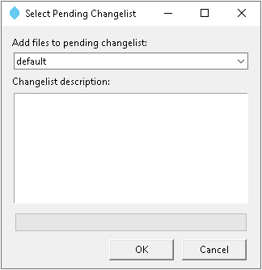
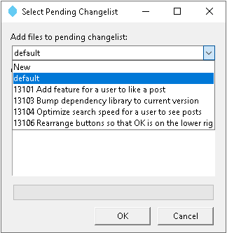
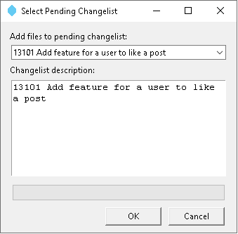
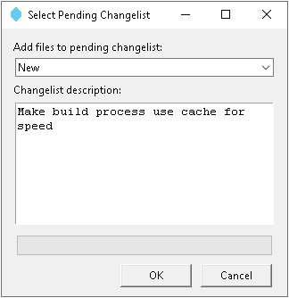
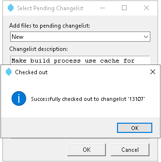

# p4checkout

`p4checkout` acts as a standalone GUI utility offering Perforce users the ability to check out 
a file to a specific pending changelist. 
While this ability is available out of the box by directly using the official Perforce visual 
client (`p4v`), it's convenient to integrate it into the user's IDE. Most popular IDEs have 
an official Perforce plugin, but those that don't can use `p4checkout` to easily check out 
files before editing them.

## Screenshots











For reference, the official pop-up box from `p4v`:


## Usage

```console
$ p4checkout -h
usage: p4checkout [-h] [-v] [-p PORT] [-c CLIENT] [-s HOST] [-u USER] path

positional arguments:
  path                  Path to file to check out

options:
  -h, --help            show this help message and exit
  -v, --verbose         Verbosity (-v, -vv, etc.)
  -p PORT, --port PORT  P4 port (e.g. 'ssl:localhost:1666')
  -c CLIENT, --client CLIENT
                        P4 client
  -s HOST, --host HOST  P4 host
  -u USER, --user USER  P4 user
```

> Note: Perforce can usually correctly infer some input parameters such as the host or user. 
> It's only required to provide them if for some reason Perforce won't pick them up correctly.

## IDE Integration

Most popular IDEs have a fully-featured Perforce plugin which includes this functionality and more.  
However, if you're using an IDE / editor which doesn't have a Perforce plugin, it might be possible to integrate 
this basic check-out functionality using a custom "run" feature, if your IDE offers it. 
Here are a few examples:

 * [Source Insight](https://www.sourceinsight.com/doc/v4/userguide/index.html#t=Manual%2FConcepts%2FSource_Control_Commands.htm)
 * [Notepad++](https://npp-user-manual.org/docs/run-menu/)

## Prerequisites

 * Python 3.9+ with Tkinter (`sudo apt-get install python3-tk`)
 * The [`p4python`](https://pypi.org/project/p4python/) package (`pip install p4python`)
 * A working Perforce setup

## Background

I originally developed this utility around 2013. The original version was written in C# and 
was used for integration with [Source Insight](https://www.sourceinsight.com/). 
The code in this repository is a recent Python port (2023) inspired by the original C# code.
However, as I (unfortunately) don't work on any Perforce-based projects anymore, it was only tested on a 
non-production basic home-setup created for this purpose only.  

(One last thing, since it has to be said: `p4v` probably has the best UX/UI that I've ever encountered).

## Limitations

 * `p4checkout` doesn't handle logging in to Perforce. Use `p4v` or `p4 login` to renew 
    your session if it has expired.

## License

`p4checkout` is released under MIT license.

`p4checkout` is an independent software tool. 
It is not an official product of Perforce Software, Inc., and is in no way affiliated with or endorsed by Perforce Software, Inc. 
Perforce® is a registered trademark of Perforce Software, Inc.